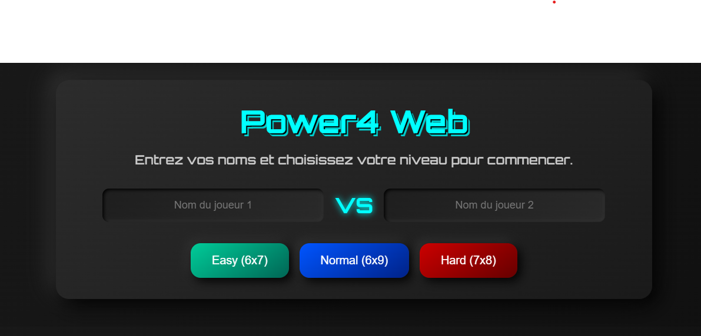
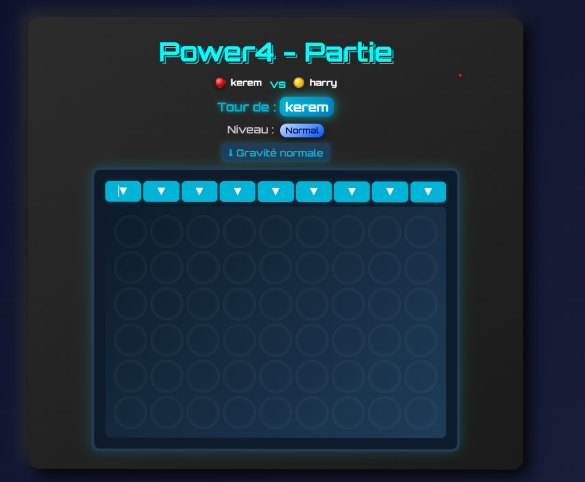

# Power4 Web — User Guide (English)

This document explains how to run and understand the "Power4 Web" project. It is written for a non-technical user: commands are simple and explained step‑by‑step.

## What is this project?

Power4 Web is a web version of Connect Four. A small Go (Golang) HTTP server runs locally and serves a web interface. Two players play on the same computer in the browser. All game rules (token placement, win/draw detection, and a gravity inversion mechanic) run on the server.

## 🧩 Interface Preview

Below are a few screenshots showing the main parts of the game:

### 🏁 Welcome Screen

  

### 🕹️ Game Board

  

### 🔄 Gameplay Preview (GIF)

  

---

## Requirements

- A Linux machine (the project was developed on Linux).
- Go installed (recommended Go 1.18+). Check with:
  - go version
- A modern web browser (Chrome, Firefox, Edge...).

If Go is not installed, follow instructions at <https://go.dev/doc/install>.

## Start the server (step by step)

1. Open a terminal.
2. Go to the project folder:
   - cd /home/jr/power4-web
3. (Optional) install/update Go module dependencies:
   - go mod tidy
4. Start the server:
   - go run ./cmd
5. Open a browser and go to:
   - <http://localhost:8080>
6. To stop the server: press Ctrl+C in the terminal.

Optional: build a binary and run it:

- go build -o power4 ./cmd
- ./power4

---

## Project layout (important files)

- cmd/
  - main.go — server entry point (registers routes and starts listening).
- internal/server/
  - game.go — game state and logic (Game struct, PlaceToken, CheckWin, CheckDraw, RenderedGrid, gravity logic).
  - handlers.go — HTTP handlers (index, welcome, game, play, rematch, result flows).
- templates/ — HTML templates used by the server:
  - index.html — main page (player input / level selection).
  - welcome.html — confirmation page before starting.
  - game.html — game board view.
  - win.html — victory screen.
  - draw.html — draw screen.
  - mockup_*.html — demonstration/mockup pages.
- static/
  - css/style.css — general styling.
  - css/board.css — board, tokens, gravity visuals and winning highlight.
  - js/script.js — client scripts (level selection, confetti, UI helpers).
  - sounds/ — optional sound files.
- go.mod — Go module file.
- README.md — this file.

## How to play (user flow)

1. Open <http://localhost:8080.>
2. Enter Player 1 and Player 2 names and choose a difficulty:
   - Easy: 6 rows x 7 cols (classic)
   - Normal: 6 x 9
   - Hard: 7 x 8
3. Click "Start game".
4. On the game page:
   - Use the column buttons to play (each click posts a move to the server).
   - The server updates the board and alternates the current player.
   - The page reloads to show the updated board and the next turn.
5. Gravity inversion (bonus mechanic):
   - Every 5 turns the server flips gravity.
   - Gravity down: tokens fall from top (normal behavior).
   - Gravity up: tokens "rise" from bottom (inverse).
   - The board color and visual indicators change when gravity is inverted.
6. When a win or draw is detected:
   - The game page highlights the winning tokens.
   - After a short delay it redirects to the dedicated result page (win or draw).
7. On the result page you can:
   - Rematch (same players and difficulty).
   - New game (return to welcome to change players/difficulty).

## Important implementation notes (simple)

- Game state is stored in memory in a global variable (currentGame). If you stop the server the game is lost.
- Server-side templates (Go templates) build the HTML sent to the browser.
- The server exposes routes such as:
  - GET / — index
  - POST /game — start a game (from welcome)
  - POST /play — submit a move
  - POST /rematch — rematch or new game
  - GET /result — final result page (win / draw)
  - Static files served under /static/

## Where to change things (if you want to customize)

- Change rules / gravity / win detection: edit internal/server/game.go.
- Change handlers or add routes: edit internal/server/handlers.go.
- Change page HTML: edit templates/*.html.
- Change design/colors/effects: edit static/css/style.css and static/css/board.css.
- Change client behaviors (confetti, sounds): edit static/js/script.js and static/sounds/.

## Manual test checklist

- Start server and open main page.
- Enter two names and choose difficulty.
- Play a full game and verify:
  - Tokens place correctly.
  - Turn alternation works.
  - Win detection for horizontal, vertical, diagonal lines.
  - Draw detection when grid fills with no winner.
  - Gravity flips every 5 turns and visual board color changes.
- Check rematch and new game flows.
- Visit mockup pages to inspect design options.

## Troubleshooting

- 404 on /static/... — start the server from the project root folder (where static/ is located).
- Port 8080 busy — edit cmd/main.go to use a different port and restart.
- Changes not visible in browser — hard refresh (Ctrl+F5) or clear cache.
- Go build or run errors — ensure Go is installed and run `go mod tidy`.

## Next improvements (suggestions)

- Persist game state to a file (JSON) to recover games after restart.
- Add unit tests for internal/server/game.go logic.
- Improve accessibility (keyboard play, screen reader labels).
- Add sound volume controls and mute toggle.
